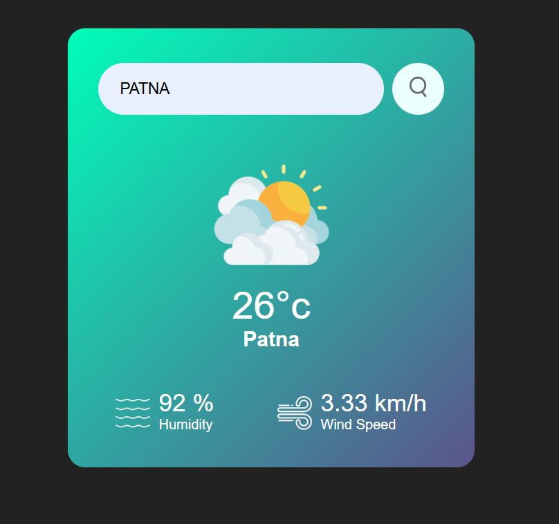

# 🌤️ Weather Info App
 
 
A simple and responsive weather application that provides real-time weather data for any city around the world using the OpenWeatherMap API.

🚀 Features
🌍 Search weather by city name

📍 Detect user location and show weather

🌡️ Display temperature, humidity, wind speed, and condition

🌓 Dynamic UI based on weather conditions and time

📱 Mobile-friendly and responsive design

🛠️ Tech Stack
Frontend: HTML, CSS, JavaScript

API: OpenWeatherMap

🌐 Live Demo: [Open App](https://dainty-kringle-9459d6.netlify.app/)

📦 How to Run
Follow the steps below to set up and run the project locally:

1. Clone the Repository
   git clone https://github.com/sumitjaiswal9334/Weather-Info-App.git
   cd Weather-Info-App
   
2. Configure API Key
   const apiKey = "const apiKey = "f9e3a3aef33146bc8e0cbc889fb833c9"
   
3. Run the App
   open index.html directly in your browser.

🧠 Future Improvements
Add weather forecast for upcoming days

Support for multiple units (Celsius, Fahrenheit)

Save recent searches

Dark mode toggle

📌 Notes
Ensure your internet connection is active when running the app

This is a front-end only project. For production, never expose your API key directly in JavaScript

📃 License
This project is open-source and available under the MIT License.

